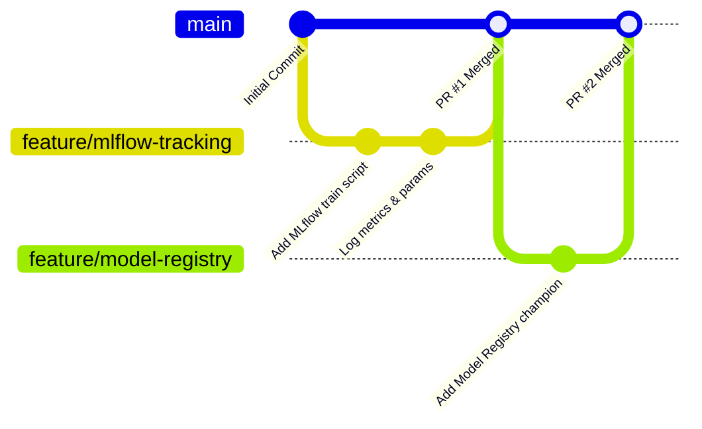

# Comprehensive Guide: Git Collaboration, Feature Branching & Merge Conflict Resolution

This document serves as an exhaustive reference and hands-on laboratory guide for **Milestone 5** of the MLOps Assignment. It explains the theory of version control, feature-branch workflows, why merge conflicts happen, and provides a **step-by-step reproducible simulation** of creating and resolving a Git merge conflict.

---

## 1. Git Fundamentals & Feature Branching Workflow

In modern software and MLOps engineering, the `main` branch represents production-ready code. Developers **never** push experimental code directly to `main`. Instead, they follow the **Feature Branch Workflow**:



### Standard Workflow Steps:
1. **Branching**: Create an isolated branch from `main`:
   ```bash
   git checkout -b feature/mlflow-tracking
   ```
2. **Developing**: Make modular commits with clear messages.
3. **Pushing**: Push your branch to GitHub:
   ```bash
   git push origin feature/mlflow-tracking
   ```
4. **Pull Request (PR)**: Open a PR on GitHub to trigger CI tests (`ci.yml`).
5. **Merge**: Once CI passes and code review is complete, merge into `main`.

---

## 2. What Causes a Git Merge Conflict?

A **Merge Conflict** occurs when:
1. Two different branches modify the **exact same line(s)** of a file, OR
2. One branch edits a file while another branch deletes that same file.

When Git attempts to merge these branches automatically, it cannot determine which version is correct. It pauses the merge process, inserts **conflict markers** into the affected file(s), and requires a human developer to manually decide what to keep.

---

## 3. Anatomy of Git Conflict Markers

When a conflict occurs, Git modifies your local file and inserts special markers:

```python
<<<<<<< HEAD (Current change on main branch)
MODEL_ESTIMATORS = 150
LEARNING_RATE = 0.05
=======
MODEL_ESTIMATORS = 300
LEARNING_RATE = 0.01
>>>>>>> feature/hyperparameter-tuning (Incoming change)
```

### Breakdown:
- `<<<<<<< HEAD`: Marks the start of the conflicting block from your current branch (`main`).
- `=======`: The separator separating the two conflicting versions.
- `>>>>>>> <branch-name>`: Marks the end of the incoming changes from the branch being merged.

---

## 4. Hands-On Simulation: Reproducing & Resolving a Merge Conflict

Follow these exact terminal commands to simulate and resolve a real merge conflict for your report.

### Step 1: Ensure Working Tree is Clean on `main`
```bash
git checkout main
git status
```

### Step 2: Create a Feature Branch (`conflict-simulation`)
```bash
git checkout -b conflict-simulation
```

### Step 3: Edit a Configuration on `conflict-simulation`
Open `src/train.py` (or a config file `config.py`) and modify a hyperparameter line:
```python
# Change in conflict-simulation:
RANDOM_STATE = 99
```

Commit the change on this branch:
```bash
git add src/train.py
git commit -m "feat: update random seed to 99 for experimentation"
```

---

### Step 4: Switch Back to `main` and Make a Conflicting Edit
```bash
git checkout main
```

Now on `main`, modify the **exact same line** to a different value:
```python
# Change on main:
RANDOM_STATE = 42  # standard reproducible seed
```

Commit the change on `main`:
```bash
git add src/train.py
git commit -m "fix: enforce standard seed 42 on main"
```

---

### Step 5: Attempt to Merge the Feature Branch (Trigger Conflict)
```bash
git merge conflict-simulation
```

### Terminal Output Produced:
```text
Auto-merging src/train.py
CONFLICT (content): Merge conflict in src/train.py
Automatic merge failed; fix conflicts and then commit the result.
```

---

### Step 6: Inspect Conflict Status
Run `git status` to see unmerged paths:
```bash
git status
```

Output:
```text
On branch main
You have unmerged paths.
  (fix conflicts and run "git commit")
  (use "git merge --abort" to abort the merge)

Unmerged paths:
  (use "git add <file>..." to mark resolution)
	both modified:   src/train.py
```

---

### Step 7: Resolve the Conflict Manually

Open `src/train.py`. You will see:
```python
<<<<<<< HEAD
RANDOM_STATE = 42  # standard reproducible seed
=======
RANDOM_STATE = 99
>>>>>>> conflict-simulation
```

**Decision**: We choose the standard reproducible seed (`42`) required by Assignment 1.

Delete the conflict markers and keep the desired code:
```python
RANDOM_STATE = 42
```

Save the file.

---

### Step 8: Stage and Finalize the Merge Commit
```bash
git add src/train.py
git commit -m "merge: resolve merge conflict between main and conflict-simulation by preserving seed 42"
```

Output:
```text
[main d4e8f12] merge: resolve merge conflict between main and conflict-simulation by preserving seed 42
```

---

### Step 9: View the Resulting Git Commit Tree
Run:
```bash
git log --graph --oneline --all -n 8
```

Example Output for Report:
```text
*   d4e8f12 (HEAD -> main) merge: resolve merge conflict between main and conflict-simulation by preserving seed 42
|\  
| * a1b2c3d (conflict-simulation) feat: update random seed to 99 for experimentation
* | 8e7f6a5 fix: enforce standard seed 42 on main
|/  
* 5c4d3e2 Add complete MLOps pipeline and tests
```

---

## 5. Visual Conflict Resolution in VS Code / Antigravity IDE

When you open a conflicting file in modern editors, you are presented with intuitive quick-action buttons above the conflict:
1. **Accept Current Change**: Keeps the code from `HEAD` (`main`).
2. **Accept Incoming Change**: Keeps the code from the merged branch.
3. **Accept Both Changes**: Retains both snippets.
4. **Compare Changes**: Opens a 3-way side-by-side diff view.

---

## 6. Best Practices for MLOps Teams
- **Pull Frequently**: Run `git pull origin main` into your feature branch often to detect divergences early.
- **Keep PRs Small & Focused**: Large, long-lived branches increase the probability of severe conflicts.
- **Separate Configs from Logic**: Store model hyperparameters in modular config files (e.g. YAML or dedicated config modules).
- **Enforce Automated CI**: Never merge a PR unless all automated quality gates pass.
